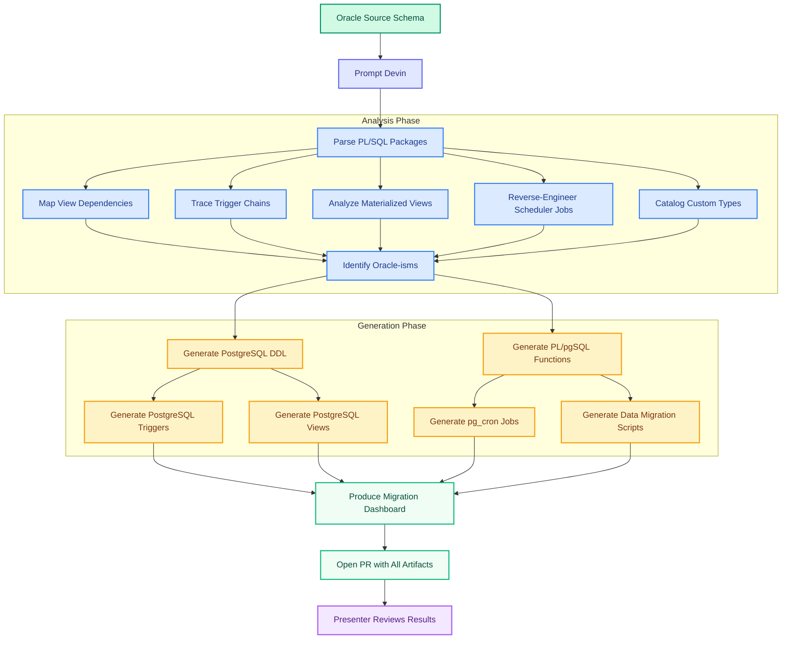
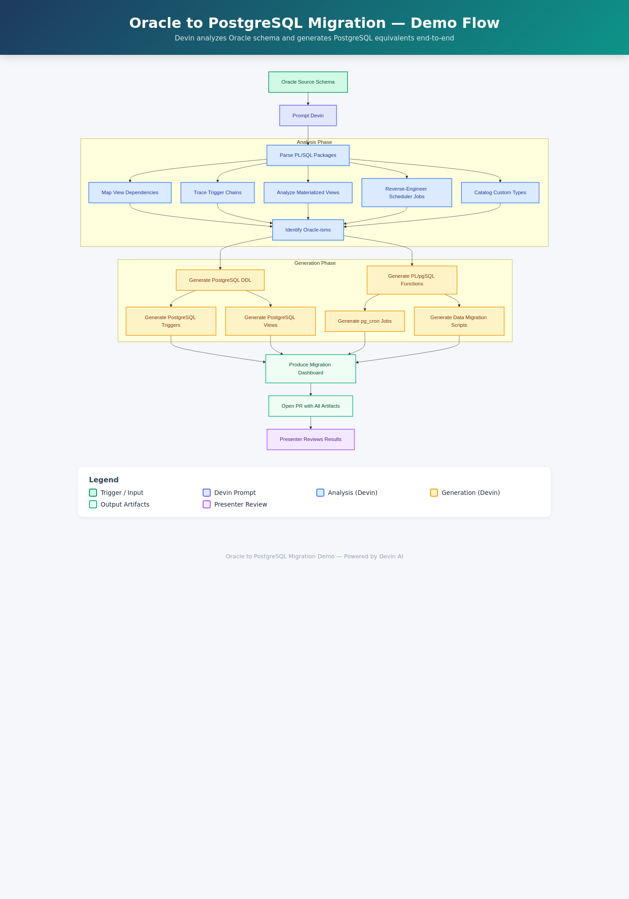

# Oracle to PostgreSQL Migration Demo — Automotive Manufacturing

> **Devin AI** analyzing and migrating a complete Oracle Database estate (PL/SQL packages, views, materialized views, triggers, DBMS_SCHEDULER jobs, custom types) to PostgreSQL.
> All company names, data, and identifiers in this demo are fictional.

---



<details>
<summary>Flowchart (PNG fallback)</summary>



</details>

[Interactive flowchart (HTML)](docs/flowchart.html)

---

## What this demo shows

An automotive manufacturer running Oracle Database 19c for manufacturing execution, supply chain, and warranty systems needs to migrate to PostgreSQL. The Oracle estate includes PL/SQL packages with Oracle-specific constructs (CONNECT BY, DECODE, NVL, autonomous transactions, ROWNUM, pipelined table functions), materialized views with scheduled refresh, DBMS_SCHEDULER job chains, and custom object types with member functions. Devin analyzes the entire schema and generates idiomatic PostgreSQL equivalents — not a mechanical find-and-replace, but a semantically correct migration that maps each Oracle construct to its proper PostgreSQL counterpart.

## What Devin does live

In the live demo session, Devin:
1. **Parses** all 3 PL/SQL packages (~680 lines) to identify Oracle-specific constructs
2. **Maps** 5 views (including CONNECT BY hierarchical queries) to PostgreSQL equivalents using WITH RECURSIVE
3. **Converts** 4 materialized views with their refresh schedules to PostgreSQL REFRESH MATERIALIZED VIEW + pg_cron
4. **Rewrites** 7 triggers from Oracle :NEW/:OLD syntax to PostgreSQL NEW/OLD with trigger functions
5. **Translates** 6 DBMS_SCHEDULER jobs (including a job chain) to pg_cron scheduled tasks
6. **Generates** data migration scripts converting Oracle data types (NUMBER, VARCHAR2, DATE-with-time) to PostgreSQL equivalents
7. **Updates** the migration dashboard in real time as each artifact is produced
8. **Opens a PR** with all generated PostgreSQL code for review

The audience sees the dashboard progressing from 0% → 100% as Devin works, with each artifact appearing in the PR.

## How the demo runs

**Trigger prompt** (paste into a Devin session pointed at this repo):

> Analyze the complete Oracle schema in `oracle_source/` — parse every PL/SQL package, map all view dependencies, trace trigger chains, reverse-engineer DBMS_SCHEDULER jobs, identify every Oracle-specific SQL construct. Then generate the full PostgreSQL migration into `postgres_target/`: DDL schemas with PostgreSQL data types, PL/pgSQL functions replacing PL/SQL packages (use WITH RECURSIVE for CONNECT BY, COALESCE for NVL, CASE for DECODE), PostgreSQL triggers with trigger functions, views, pg_cron job definitions, and data migration scripts. Update `dashboard/migration_state.json` as you complete each artifact.

Devin runs end-to-end inside the session. The presenter opens the dashboard in a browser tab to show real-time progress, then reviews the PR Devin opens with all generated artifacts.

## Repo layout

```
oracle_source/
├── schema/mfg_schema.sql              # 8 tables, 6 sequences, 8 indexes
├── packages/
│   ├── pkg_parts_inventory.sql        # Inventory mgmt (autonomous txn, NVL, DECODE)
│   ├── pkg_bom_processor.sql          # BOM explosion (CONNECT BY, PIPELINED, BULK COLLECT)
│   └── pkg_warranty_claims.sql        # Claims processing (MONTHS_BETWEEN, ROWNUM, FOR UPDATE)
├── views/mfg_views.sql                # 5 views (CONNECT BY hierarchy, DECODE, date math)
├── materialized_views/mfg_matviews.sql # 4 mat views (BUILD IMMEDIATE, QUERY REWRITE)
├── triggers/mfg_triggers.sql          # 7 triggers (:NEW/:OLD, RAISE_APPLICATION_ERROR)
├── jobs/mfg_scheduler_jobs.sql        # 6 jobs + 1 chain (DBMS_SCHEDULER, DBMS_MVIEW)
├── types/mfg_types.sql                # 6 types (OBJECT with MEMBER FUNCTION, TABLE OF)
└── data/seed_data.sql                 # Reference data (plants, parts, suppliers, BOM)

postgres_target/                        # Empty — Devin populates this live
├── schema/    functions/    triggers/
├── views/     jobs/         types/     data/

dashboard/
├── index.html                          # Migration progress dashboard
└── migration_state.json                # State file (Devin updates during demo)

docs/
├── IMPLEMENTATION_PLAN.md
├── flowchart.html                      # Interactive Mermaid diagram
└── flowchart.png                       # Rasterized version
```

## Key concepts

| Oracle Construct | PostgreSQL Equivalent | Migration Notes |
|---|---|---|
| `CONNECT BY PRIOR` | `WITH RECURSIVE` | Recursive CTE; `LEVEL` → depth counter; `SYS_CONNECT_BY_PATH` → string concat in CTE |
| `NVL(a, b)` | `COALESCE(a, b)` | SQL standard; COALESCE supports multiple args |
| `DECODE(a,b,c,d)` | `CASE WHEN a=b THEN c ELSE d END` | SQL standard CASE expression |
| `SYSDATE` | `CURRENT_TIMESTAMP` / `NOW()` | Oracle DATE includes time; use TIMESTAMP in PG |
| `ROWNUM <= n` | `LIMIT n` | Or `FETCH FIRST n ROWS ONLY` (SQL:2008) |
| `PRAGMA AUTONOMOUS_TRANSACTION` | `dblink` / separate connection | No direct PG equivalent |
| `DBMS_SCHEDULER` | `pg_cron` / `pgAgent` | Extension required; calendar syntax differs |
| `CREATE TYPE AS OBJECT` | `CREATE TYPE AS (composite)` | PG composites have no member functions |
| `PIPELINED TABLE FUNCTION` | `RETURNS SETOF` / `RETURNS TABLE` | Set-returning function |
| `MONTHS_BETWEEN` | `EXTRACT(EPOCH FROM age(...))/2592000` | Or use `age()` + extract |
| `VARCHAR2(n)` | `VARCHAR(n)` | Drop the "2" |
| `NUMBER(p,s)` | `NUMERIC(p,s)` | Direct equivalent |
| `:NEW` / `:OLD` (triggers) | `NEW` / `OLD` | No colon prefix in PG |
| `RAISE_APPLICATION_ERROR` | `RAISE EXCEPTION` | Different syntax |

## Data Type Mapping Artifacts

Two additional artifacts visualize the complete Oracle-to-PostgreSQL data type and construct mapping tables derived from `dashboard/migration_state.json`:

### Interactive Flowchart

[`docs/data_type_mapping_flowchart.html`](docs/data_type_mapping_flowchart.html) — a Mermaid-based interactive diagram with three sections:
- **Data Type Mappings** — Oracle types (NUMBER, VARCHAR2, DATE, CLOB, BLOB, RAW) mapped to PostgreSQL equivalents
- **Construct Mappings** — Oracle SQL/PL/SQL constructs (SYSDATE, NVL, DECODE, CONNECT BY, etc.) mapped to idiomatic PostgreSQL
- **Artifact Usage** — which packages, views, and materialized views use which Oracle-specific features

### PDF Reference

Run the generation script to produce a printable PDF at `docs/data_type_mapping.pdf`:

```bash
pip install fpdf2
python scripts/generate_mapping_pdf.py
```

The PDF contains:
- A title page
- Data type mapping table (Oracle Type | PostgreSQL Type | Notes)
- Construct mapping table (Oracle Construct | PostgreSQL Equivalent | Notes)
- Artifact feature usage table (Artifact ID | Type | Oracle Features)

The script reads `dashboard/migration_state.json` and can be run from the repo root.

---

## Cognition case studies

### COBOL Modernization at Fortune 500 Companies
Cognition has delivered multiple large-scale legacy modernization projects. From the [April 2026 blog post](https://www.cognition.ai/blog/how-devin-is-modernizing-cobol-at-fortune-500-companies):

- **Fortune 500 Healthcare Company** — Devin documented millions of lines of COBOL claims processing code. Using DeepWiki for codebase indexing, Devin traced data flows across program boundaries and identified critical financial safeguards that were previously undocumented.

- **Top 10 Global Automotive OEM** — Migrated a 25,000-line COBOL customs workflow to AWS Lambda. Devin analyzed I/O patterns, wrote Python equivalents, and iterated until outputs matched — delivering an estimated **73% reduction in migration costs**.

- **Itaú Unibanco** — Largest private bank in Latin America. Devin refactored corporate tax ID handling across hundreds of COBOL programs with 20 field variations, completing the work **5–6x faster** than manual effort, three months ahead of a government deadline, with zero production errors.

### Mercedes-Benz Partnership
Mercedes-Benz is [deploying Devin and Windsurf](https://www.cognition.ai/blog/mercedes-benz-cognition) across its global engineering organization, starting with **legacy modernization**, cloud-native development, and logistics — directly relevant to the database migration challenges this demo addresses.

These case studies demonstrate Devin's ability to understand complex legacy systems, map constructs across technology boundaries, and execute migrations autonomously at scale — the same capabilities required for Oracle-to-PostgreSQL migration.
